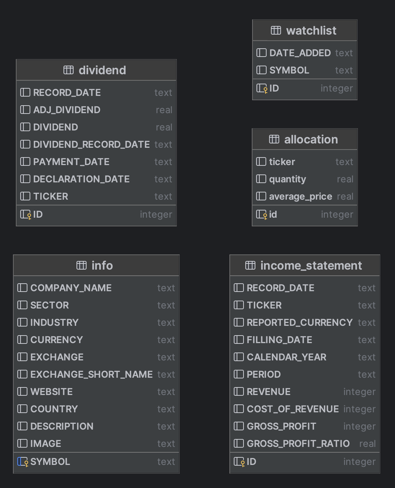

# Dividend Printer
Tool for tracking and analysing dividend stocks.

This is the prototype version of the application. <u>**Executing the code recreates all tables at this point.**</u>

# Execution

All tables, apart from the allocation, are created using [Financial Modelling Prep API](https://site.financialmodelingprep.com/developer/docs). 

## Allocation

The allocation is fetched using [Trading 212 API](https://t212public-api-docs.redoc.ly/).

You can get your portfolio from:
- Demo endpoint: https://demo.trading212.com/api/v0/equity/portfolio
- Live endpoint: https://live.trading212.com/api/v0/equity/portfolio

You can generate an API key for both in Trading 212 app.

```python
from db_manager.allocation import (
    create_allocation_table,
    create_allocation_dataframe,
    insert_into_allocation_table
)

create_allocation_table()
allocation = create_allocation_dataframe()
insert_into_allocation_table(allocation)
```

## Dividends

```python
import pandas as pd
from db_manager.allocation import create_allocation_dataframe
from db_manager.dividend import create_dividend_table, update_dividends

allocation: pd.DataFrame = create_allocation_dataframe()

create_dividend_table()
update_dividends(allocation)
```

## Income statement

```python
import pandas as pd
from db_manager.allocation import create_allocation_dataframe
from db_manager.income_statement import create_income_statement_table, update_income_statement

allocation: pd.DataFrame = create_allocation_dataframe()

create_income_statement_table()
update_income_statement(allocation)
```

## Info

```python
import pandas as pd
from db_manager.allocation import create_allocation_dataframe
from db_manager.info import create_info_table, update_info

allocation: pd.DataFrame = create_allocation_dataframe()

create_info_table()
update_info(allocation)
```

## Watchlist

TBD

# Database

## Schema

